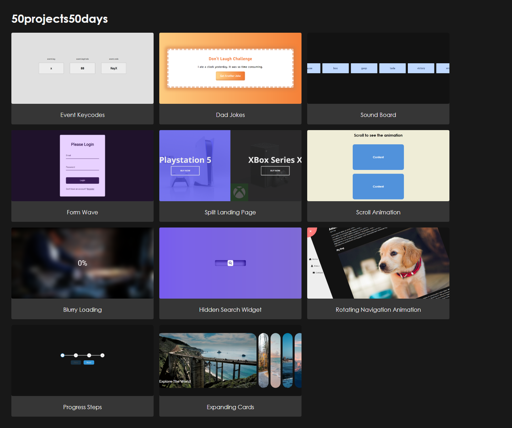

# 50 Projects in 50 Days - HTML/CSS and JavaScript

Son bir sene sadece CSS'e yoğunlaşmıştım. JavaScript yazmanın zamanı geldi diye düşünüyorum.
Bu sebepten ötürü alıştırma yapacağım siteler, Github depoları vesaire araştırmaya başladım.
Bu çalışmalar, kendimi geliştirmeme ne kadar yarıyorsa; bir o kadar da benim portföyüme de etki edecek. Şayet, siz de kendinizi HTML/CSS/JS konusunda geliştirmek istiyorsanız,
[50projects50days](https://50projects50days.com) sayfasını ziyaret edebilir ve benim
çalışmalarımdan da ilham alabilirsiniz.

|  #  | Project                                                                                                                   | Live Demo                                                                                               |
| :-: | ------------------------------------------------------------------------------------------------------------------------- | ------------------------------------------------------------------------------------------------------- |
| 01  | [Expanding Cards](https://github.com/rehberbey/50projects50days/tree/master/expanding-cards)                              | [Live Demo](https://rehberbey.github.io/50projects50days/expanding-cards/views/index.html)              |
| 02  | [Progress Steps](https://github.com/rehberbey/50projects50days/tree/master/progress-steps)                                | [Live Demo](https://rehberbey.github.io/50projects50days/progress-steps/views/index.html)               |
| 03  | [Rotating Navigation Animation](https://github.com/rehberbey/50projects50days/tree/master/rotating-nav-animation)         | [Live Demo](https://rehberbey.github.io/50projects50days/rotating-nav-animation/views/index.html)       |
| 04  | [Hidden Search Widget](https://github.com/rehberbey/50projects50days/tree/master/hidden-search)                           | [Live Demo](https://rehberbey.github.io/50projects50days/hidden-search/views/index.html)                |
| 05  | [Blurry Loading](https://github.com/rehberbey/50projects50days/tree/master/blurry-loading)                                | [Live Demo](https://rehberbey.github.io/50projects50days/blurry-loading/views/index.html)               |
| 06  | [Scroll Animation](https://github.com/rehberbey/50projects50days/tree/master/scroll-animation)                            | [Live Demo](https://rehberbey.github.io/50projects50days/scroll-animation/views/index.html)             |
| 07  | [Split Landing Page](https://github.com/rehberbey/50projects50days/tree/master/split-landing-page)                        | [Live Demo](https://rehberbey.github.io/50projects50days/split-landing-page/views/index.html)           |
| 08  | [Form Wave](https://github.com/rehberbey/50projects50days/tree/master/form-input-wave)                                    | [Live Demo](https://rehberbey.github.io/50projects50days/form-input-wave/views/index.html)              |
| 09  | [Sound Board](https://github.com/rehberbey/50projects50days/tree/master/sound-board)                                      | [Live Demo](https://rehberbey.github.io/50projects50days/sound-board/views/index.html)                  |
| 10  | [Dad Jokes](https://github.com/rehberbey/50projects50days/tree/master/dad-jokes)                                          | [Live Demo](https://rehberbey.github.io/50projects50days/dad-jokes/views/index.html)                    |
| 11  | [Event Keycodes](https://github.com/rehberbey/50projects50days/tree/master/event-keycodes)                                | [Live Demo](https://rehberbey.github.io/50projects50days/event-keycodes/views/index.html)               |
| 12  | ❌ [Faq Collapse](https://github.com/rehberbey/50projects50days/tree/master/faq-collapse)                                 | [Live Demo](https://rehberbey.github.io/50projects50days/faq-collapse/views/index.html)                 |
| 13  | ❌ [Random Choice Picker](https://github.com/rehberbey/50projects50days/tree/master/random-choice-picker)                 | [Live Demo](https://rehberbey.github.io/50projects50days/random-choice-picker/views/index.html)         |
| 14  | ❌ [Animated Navigation](https://github.com/rehberbey/50projects50days/tree/master/animated-navigation)                   | [Live Demo](https://rehberbey.github.io/50projects50days/animated-navigation/views/index.html)          |
| 15  | ❌ [Incrementing Counter](https://github.com/rehberbey/50projects50days/tree/master/incrementing-counter)                 | [Live Demo](https://rehberbey.github.io/50projects50days/incrementing-counter/views/index.html)         |
| 16  | ❌ [Drink Water](https://github.com/rehberbey/50projects50days/tree/master/drink-water)                                   | [Live Demo](https://rehberbey.github.io/50projects50days/drink-water/views/index.html)                  |
| 17  | ❌ [Movie App](https://github.com/rehberbey/50projects50days/tree/master/movie-app)                                       | [Live Demo](https://rehberbey.github.io/50projects50days/movie-app/views/index.html)                    |
| 18  | ❌ [Background Slider](https://github.com/rehberbey/50projects50days/tree/master/background-slider)                       | [Live Demo](https://rehberbey.github.io/50projects50days/background-slider/views/index.html)            |
| 19  | ❌ [Theme Clock](https://github.com/rehberbey/50projects50days/tree/master/theme-clock)                                   | [Live Demo](https://rehberbey.github.io/50projects50days/theme-clock/views/index.html)                  |
| 20  | ❌ [Button Ripple Effect](https://github.com/rehberbey/50projects50days/tree/master/button-ripple-effect)                 | [Live Demo](https://rehberbey.github.io/50projects50days/button-ripple-effect/views/index.html)         |
| 21  | ❌ [Drag N Drop](https://github.com/rehberbey/50projects50days/tree/master/drag-n-drop)                                   | [Live Demo](https://rehberbey.github.io/50projects50days/drag-n-drop/views/index.html)                  |
| 22  | ❌ [Drawing App](https://github.com/rehberbey/50projects50days/tree/master/drawing-app)                                   | [Live Demo](https://rehberbey.github.io/50projects50days/drawing-app/views/index.html)                  |
| 23  | ❌ [Kinetic Loader](https://github.com/rehberbey/50projects50days/tree/master/kinetic-loader)                             | [Live Demo](https://rehberbey.github.io/50projects50days/kinetic-loader/views/index.html)               |
| 24  | ❌ [Content Placeholder](https://github.com/rehberbey/50projects50days/tree/master/content-placeholder)                   | [Live Demo](https://rehberbey.github.io/50projects50days/content-placeholder/views/index.html)          |
| 25  | ❌ [Sticky Navbar](https://github.com/rehberbey/50projects50days/tree/master/sticky-navigation)                           | [Live Demo](https://rehberbey.github.io/50projects50days/sticky-navigation/views/index.html)            |
| 26  | ❌ [Double Vertical Slider](https://github.com/rehberbey/50projects50days/tree/master/double-vertical-slider)             | [Live Demo](https://rehberbey.github.io/50projects50days/double-vertical-slider/views/index.html)       |
| 27  | ❌ [Toast Notification](https://github.com/rehberbey/50projects50days/tree/master/toast-notification)                     | [Live Demo](https://rehberbey.github.io/50projects50days/toast-notification/views/index.html)           |
| 28  | ❌ [Github Profiles](https://github.com/rehberbey/50projects50days/tree/master/github-profiles)                           | [Live Demo](https://rehberbey.github.io/50projects50days/github-profiles/views/index.html)              |
| 29  | ❌ [Double Click Heart](https://github.com/rehberbey/50projects50days/tree/master/double-click-heart)                     | [Live Demo](https://rehberbey.github.io/50projects50days/double-click-heart/views/index.html)           |
| 30  | ❌ [Auto Text Effect](https://github.com/rehberbey/50projects50days/tree/master/auto-text-effect)                         | [Live Demo](https://rehberbey.github.io/50projects50days/auto-text-effect/views/index.html)             |
| 31  | ❌ [Password Generator](https://github.com/rehberbey/50projects50days/tree/master/password-generator)                     | [Live Demo](https://rehberbey.github.io/50projects50days/password-generator/views/index.html)           |
| 32  | ❌ [Good Cheap Fast](https://github.com/rehberbey/50projects50days/tree/master/good-cheap-fast)                           | [Live Demo](https://rehberbey.github.io/50projects50days/good-cheap-fast/views/index.html)              |
| 33  | ❌ [Notes App](https://github.com/rehberbey/50projects50days/tree/master/notes-app)                                       | [Live Demo](https://rehberbey.github.io/50projects50days/notes-app/views/index.html)                    |
| 34  | ❌ [Animated Countdown](https://github.com/rehberbey/50projects50days/tree/master/animated-countdown)                     | [Live Demo](https://rehberbey.github.io/50projects50days/animated-countdown/views/index.html)           |
| 35  | ❌ [Image Carousel](https://github.com/rehberbey/50projects50days/tree/master/image-carousel)                             | [Live Demo](https://rehberbey.github.io/50projects50days/image-carousel/views/index.html)               |
| 36  | ❌ [Hoverboard](https://github.com/rehberbey/50projects50days/tree/master/hoverboard)                                     | [Live Demo](https://rehberbey.github.io/50projects50days/hoverboard/views/index.html)                   |
| 37  | ❌ [Pokedex](https://github.com/rehberbey/50projects50days/tree/master/pokedex)                                           | [Live Demo](https://rehberbey.github.io/50projects50days/pokedex/views/index.html)                      |
| 38  | ❌ [Mobile Tab Navigation](https://github.com/rehberbey/50projects50days/tree/master/mobile-tab-navigation)               | [Live Demo](https://rehberbey.github.io/50projects50days/mobile-tab-navigation/views/index.html)        |
| 39  | ❌ [Password Strength Background](https://github.com/rehberbey/50projects50days/tree/master/password-strength-background) | [Live Demo](https://rehberbey.github.io/50projects50days/password-strength-background/views/index.html) |
| 40  | ❌ [3d Background Boxes](https://github.com/rehberbey/50projects50days/tree/master/3d-boxes-background)                   | [Live Demo](https://rehberbey.github.io/50projects50days/3d-boxes-background/views/index.html)          |
| 41  | ❌ [Verify Account Ui](https://github.com/rehberbey/50projects50days/tree/master/verify-account-ui)                       | [Live Demo](https://rehberbey.github.io/50projects50days/verify-account-ui/views/index.html)            |
| 42  | ❌ [Live User Filter](https://github.com/rehberbey/50projects50days/tree/master/live-user-filter)                         | [Live Demo](https://rehberbey.github.io/50projects50days/live-user-filter/views/index.html)             |
| 43  | ❌ [Feedback Ui Design](https://github.com/rehberbey/50projects50days/tree/master/feedback-ui-design)                     | [Live Demo](https://rehberbey.github.io/50projects50days/feedback-ui-design/views/index.html)           |
| 44  | ❌ [Custom Range Slider](https://github.com/rehberbey/50projects50days/tree/master/custom-range-slider)                   | [Live Demo](https://rehberbey.github.io/50projects50days/custom-range-slider/views/index.html)          |
| 45  | ❌ [Netflix Mobile Navigation](https://github.com/rehberbey/50projects50days/tree/master/netflix-mobile-navigation)       | [Live Demo](https://rehberbey.github.io/50projects50days/netflix-mobile-navigation/views/index.html)    |
| 46  | ❌ [Quiz App](https://github.com/rehberbey/50projects50days/tree/master/quiz-app)                                         | [Live Demo](https://rehberbey.github.io/50projects50days/quiz-app/views/index.html)                     |
| 47  | ❌ [Testimonial Box Switcher](https://github.com/rehberbey/50projects50days/tree/master/testimonial-box-switcher)         | [Live Demo](https://rehberbey.github.io/50projects50days/testimonial-box-switcher/views/index.html)     |
| 48  | ❌ [Random Image Feed](https://github.com/rehberbey/50projects50days/tree/master/random-image-generator)                  | [Live Demo](https://rehberbey.github.io/50projects50days/random-image-generator/views/index.html)       |
| 49  | ❌ [Todo List](https://github.com/rehberbey/50projects50days/tree/master/todo-list)                                       | [Live Demo](https://rehberbey.github.io/50projects50days/todo-list/views/index.html)                    |
| 50  | ❌ [Insect Catch Game](https://github.com/rehberbey/50projects50days/tree/master/insect-catch-game)                       | [Live Demo](https://rehberbey.github.io/50projects50days/insect-catch-game/views/index.html)            |

## Lisans

[MIT](https://github.com/rehberbey/50projects50days/blob/master/LICENSE)
